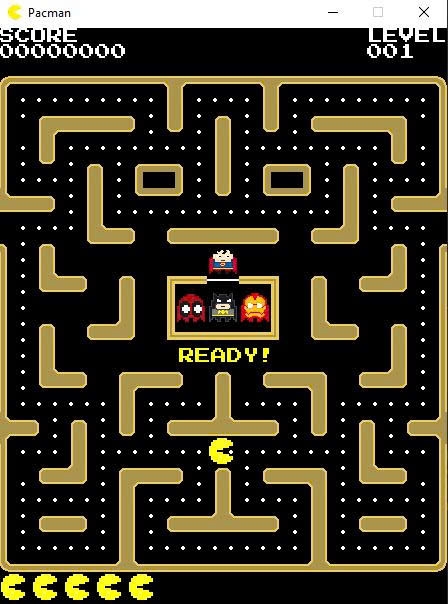

# Portfolio

---

## Pacman Game

### Classic Pacman Arcade Game

This project is an implementation of the classic **Pacman arcade game**. The player controls Pacman to move through a maze, collect pellets, and avoid ghosts while trying to achieve the highest possible score.

**Game Mechanics:**  
Players control Pacman using keyboard inputs to move around the maze. Pacman collects pellets to increase the score while avoiding ghosts that move through the map.

**Game Features:**

- Character movement using keyboard controls
- Collision detection between Pacman, walls, and ghosts
- Score tracking system
- Basic ghost AI movement
- Classic maze gameplay

**Technologies Used:**  
Python, Object-Oriented Programming, Game Logic Design

---

### Smart Bus Tracking System

The Smart Bus Tracking System is a project designed to monitor and manage bus locations in real time. 
The system allows users to track buses on a map, view estimated arrival times, and receive updates 
about bus routes and schedules. This helps passengers reduce waiting time and improves the efficiency 
of public transportation management.

**Key Features:**

- Real-time bus location tracking
- Display bus routes and stops
- Estimated arrival time for each bus
- User-friendly interface for passengers
- Data management for routes and buses

---

---

### Motorcycle Shop Management System

The Motorcycle Shop Management System is designed to help manage the operations of a motorcycle store. 
The system allows administrators and staff to manage motorcycles, customers, invoices, suppliers, and inventory efficiently. 
It provides tools for tracking sales, managing stock, and organizing business data in a structured database system.

**Key Features:**

- Manage motorcycle products and inventory
- Customer information management
- Sales and invoice management
- Supplier and purchase management
- Data storage using relational databases

 

 

---

### Freelance Marketplace Web Application

The Freelance Marketplace Web Application is a platform that connects clients with freelancers. 
Users can create accounts, post jobs, send proposals, and manage contracts through the system. 
The platform helps clients find suitable freelancers while allowing freelancers to showcase their skills and apply for jobs.

**Key Features:**

- User registration and login system
- Job posting and job search functionality
- Freelancers can submit proposals for projects
- Clients can review proposals and create contracts
- Project and contract management system

 

 

---

© 2025 Van Nguyen

